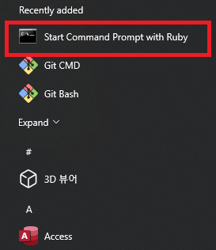

# Github 블로그 시작하기

## 1. Jekyll이란?
* Jekyll은 Templates, partials, liquid code, markdown 등과 같은 동적 구성 요소에서 정적 웹 사이트를 구축하는 데 사용되는 Ruby 기반의 Parsing Engine
  * Jekyll은 Parsing Engine으로 컨텐츠 제공하지 않으며, 템플릿이나 디자인 요소도 없음.(직접 만들어야 함)
  * Jekyll은 정적 웹사이트를 제공함. -> 동적 X <br>
    : 각 요청에 대해 컨텐츠, 템플릿 및 태그를 구문 분석 작업을 미리 한 번 수행하고 전체 웹사이트를 폴더에 캐시하여 정적으로 제공함.
  * Github pages에서 무료로 호스팅 할 수 있음.

## 2. Jekyll 설치 방법
### 1) Ruby 설치
* Jekyll은 Ruby 기반이므로 Ruby 개발환경이 필요함.
* Ruby는 각 운영체제별로 설치 방법이 다르므로 주의
* 필자는 Windows로 Window 설치 방법을 사용

#### 1-1) 설치 파일 다운로드
* 윈도우 OS의 경우 Ruby와 Devkit(개발툴킷)을 별도로 설치해줘야하므로, [Ruby 설치 홈페이지](https://rubyinstaller.org/downloads/) 에서 Devkit이 포함된 버전 다운로드
  * 필자의 경우 현 시점에서 가장 최신 버전인 Ruby+Devkit3.1.1-1(x64) 다운로드
  * 해당 설치 파일 실행 후 Next만 눌러 모두 Default 값으로 설치하면 됨.

#### 1-2) 기본 세팅
* 아래 그림과 같이 윈도우 시작 창에서 `Start Command Prompt with Ruby`를 실행

* 실행 후 가장 먼저 프롬프트에서 인코딩을 부여하기 위한 명령어로 `chcp 65001` 실행
```commandline
Active code page: 65001
```
* 위와 같은 결과가 나오면 완료